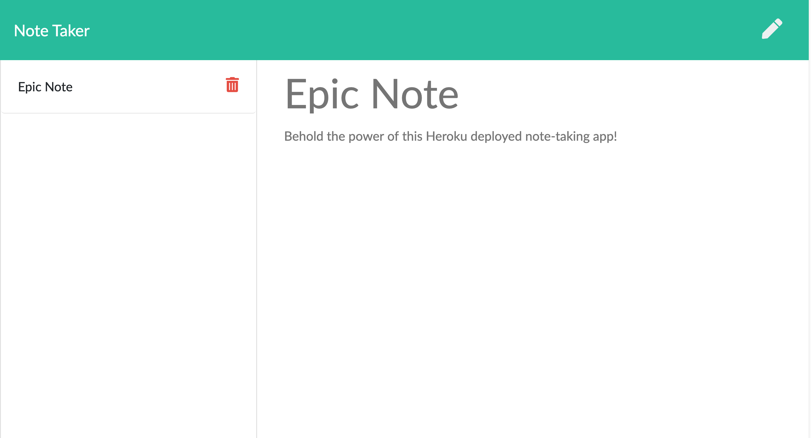

# Note Taking Application

This is a simple note taking application built with Node and Express. It allows a user to create, read, and delete notes.

## Table of Contents

- [Usage](#usage)
- [License](#license)
- [Screenshots](#screenshots)
- [Contact](#contact)

## Usage

To run the app, go to:
[https://floating-river-39173.herokuapp.com/](https://floating-river-39173.herokuapp.com/)

## License

Distributed under the MIT License. See `LICENSE` for more information.

## Screenshots

## Contact

Have a burning question about this project? You can reach me at the following:

RJ Wright - rj@rjwright.me
[![twitter][twitter-shield]][twitter-url][![LinkedIn][linkedin-shield]][linkedin-url]

[linkedin-shield]: https://img.shields.io/badge/-LinkedIn-black.svg?style=flat-square&logo=linkedin&colorB=1178B3
[linkedin-url]: https://www.linkedin.com/in/rjwrightme/
[twitter-shield]: https://img.shields.io/badge/-Twitter-black.svg?style=flat-square&logo=twitter&logoColor=FFF&colorB=2AA3EF
[twitter-url]: https://twitter.com/rjwrightme
